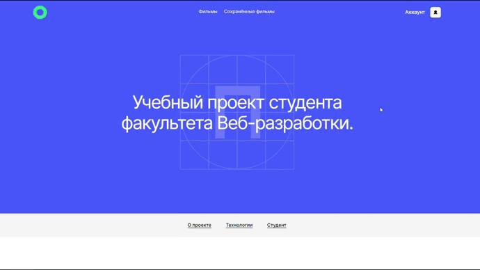
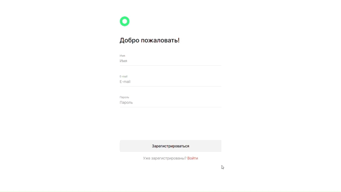
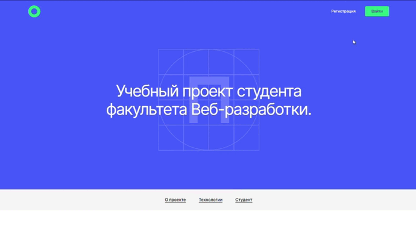
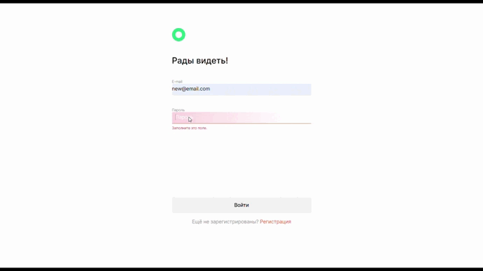
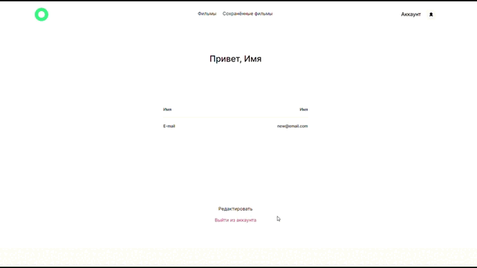
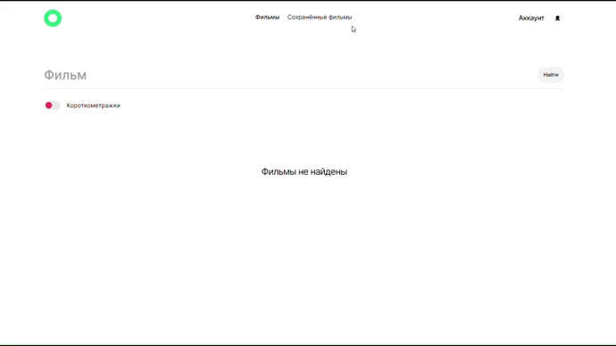
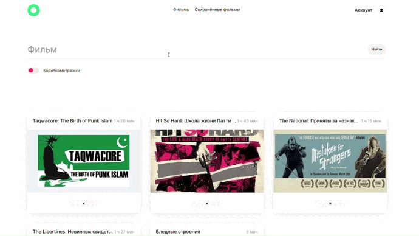
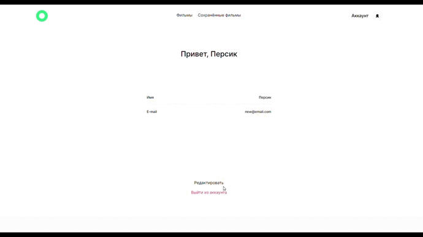

# Проект: Movies Explorer

## Обзор

* Figma
* Сайт проекта
* Описание проекта
* Что использовалось?
* Как запустить?
* Доработка

## **Figma**

[Ссылка на макет в Figma](https://disk.yandex.ru/d/BC5LL2lP7RgYYg)

## **Сайт проекта**

[Ссылка на сайт на GitHub Pages](https://frantsuzovatamara.github.io/movies-explorer-frontend/)
[Ccылка на сайт в интернете](https://movies.explorer.nomoredomains.monster/)

## **Описание проекта**

Это интерактивная страница, на которой можно:

* узнать немного обо мне, моём опыте и проектах, которые я выполняла

* регистрироваться и авторизоваться по паролю и email, выходить из профиля.

* искать фильмы по названию и длине, добавлять и удалять фильмы из сохранённые, по нажатию на постер фильма переходить на страничку, где можно посмотреть его трейлер, редактировать свой профиль

## **Что использовалось?**

* HTML
* CSS
* Методология БЭМ
* JavaScript
* Create React App
* Хуки и классовые элементы
* JSX
* Webpack
* Api

## **Как запустить?**

Для запуска проекта необходимо запустить [movies-explorer-api](https://github.com/FrantsuzovaTamara/movies-explorer-api.git) на 3000 порту командой **npm run start**, далее поменять значение константы STATUS с "production" на "development" в файле [constants](./src/utils/constants.js) и запустить на 3001 порту данное приложение (ввести в терминале команду **npm run start** в ветке main). 

## **Доработка**

Для улучшения интерфейса можно также: 

* добавить возможность находить фильмы по стране и году
* при нажатии на карточку добавить переход на страницу с более подробной информацией о фильме
* добавить возможность добавлять и менять аватар пользователя, отображать его вместо значка аккаунта